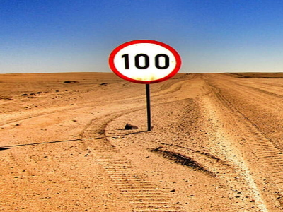
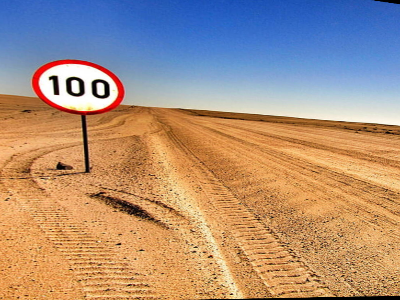
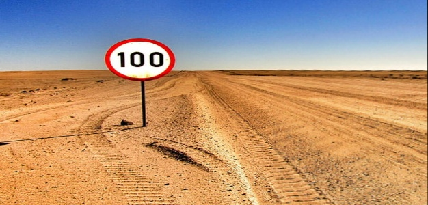

# Panorama-Stitching
  
A python script that can stitch two images into a panorama through feature detection and matching. 

## Folder Structure:
```
📦Panorama-Stitching
 ┣ 📂Media
 ┃ ┗ 📂Q2
 ┃ ┃ ┣ 📜Q2imageA.png
 ┃ ┃ ┗ 📜Q2imageB.png
 ┣ 📂Results
 ┃ ┗ 📜results.png
 ┣ 📜README.md
 ┗ 📜panorama_stitching.py  
 ```
 
 ## How To Run:
 
 * Navigate to the root of this package in a terminal
 * Ensure the python file ``panorama_stitching.py`` is executable
 * Then enter the following command:
 ```
 python3 panorama_stitching.py
 ```
## Results 
<table>
    <tr>
        <td><p align='center'>Image num:1</p></td>
        <td><p align='center'>Image num:2</p></td>
    </tr>
    <tr><td colspan="2"><p align='center'>Final Result</p></td></tr>
</table>

